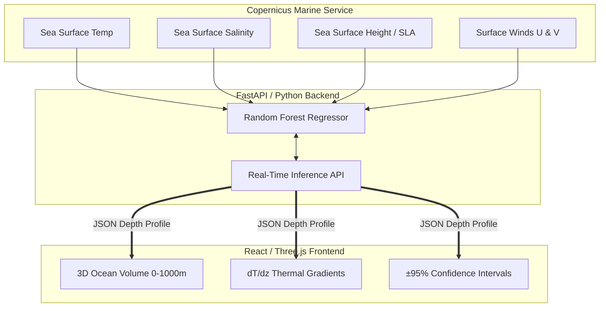

<div align="center">
  <h1 align="center">
     OceanEmbed
  </h1>
  <strong>AI-Driven 3D Ocean Thermodynamic Reconstruction</strong>
  <br/>
  <em>Presented by Team CodeStormers for Smart India Hackathon (SIH26066)</em>
  <br/><br/>
  <p align="center">
    
    
    
    
    
    
    
    
    
    
  </p>
</div>

---

## 01 / Core Architecture

OceanEmbed operates on a highly optimized, decoupled architecture separating the heavy machine-learning inference from the high-performance WebGL frontend.



---

## 02 / The Problem: The Hidden Ocean

Satellites provide massive amounts of real-time data about the ocean's surface, but they cannot penetrate the water. The deep ocean—which drives global climate, creates cyclones, and hides submarines—remains entirely hidden from space. 

While physical sensors (like Argo floats) provide incredibly accurate deep-water readings, they are sparse and drift passively, leaving massive geographical blind spots. To fully understand ocean thermodynamics, we need a way to look *beneath* the surface without relying solely on expensive, localized physical probes.

---

## 03 / The Solution: AI Subsurface Reconstruction

**OceanEmbed** bridges the gap between surface telemetry and deep-ocean reality. 

By utilizing advanced Machine Learning (a highly tuned Random Forest Regressor), our model has learned the complex, non-linear thermodynamic relationships between surface signatures and deep-water stratifications in the North Indian Ocean. 

Instead of deploying physical sensors, OceanEmbed allows researchers to click any coordinate in the ocean and instantly generate a 3D thermodynamic volume down to **1000 meters**, using only surface satellite data.

---

## 04 / Tech Stack

| Layer | Stack | Purpose in OceanEmbed |
| :--- | :--- | :--- |
| **🎨 Frontend** | React 18 · TypeScript · Vite · Tailwind CSS · Framer Motion | Component-based UI, typed development, responsive styling and interactive dashboard behavior |
| **🌐 3D & Data Visualization** | React Three Fiber · OGL · Recharts | WebGL-based 3D ocean rendering and visualization of temperature profiles, gradients and prediction outputs |
| **🔢 Data Processing** | Python 3.10 · Pandas · NumPy | Data ingestion, preprocessing, spatial transformation and numerical computation |
| **🧠 Machine Learning** | Scikit-Learn · Joblib | Random Forest regression, subsurface temperature inference and trained-model serialization |
| **⚙️ API & Model Serving** | FastAPI · Uvicorn | REST API layer for real-time inference and communication between frontend and ML pipeline |
| **🔧 DevOps** | Git · GitHub · Docker | Source-code management, collaborative development and reproducible runtime environments |
| **☁️ Deployment** | Vercel · Render | Production hosting for the frontend and FastAPI inference service |

---

## 05 / Key Features

- **Interactive 3D Dashboard:** A high-performance WebGL interface built with React Three Fiber, allowing users to rotate, pan, and explore physical ocean layers in real-time.
- **Live Inference Engine:** A FastAPI backend that hosts our Random Forest model, resolving live 3D coordinates into full thermodynamic profiles in under 100ms.
- **Acoustic Shadow Zone Detection (dT/dz):** Automatically calculates the thermal gradient per meter to locate the *Thermocline*—a critical tactical feature for naval submarine stealth operations.
- **Statistical Confidence Bounds:** Every prediction is accompanied by a ±95% scientific confidence interval, ensuring military and scientific reliability.
- **Automated Anomaly Heatmaps:** Generates visual heatmaps comparing live predictions against a 20-year historical climatology baseline to instantly detect marine heatwaves.

---

## 06 / Machine Learning Pipeline

1. **Data Acquisition:** Surface telemetry (SST, SSS, SSH, Winds) is ingested directly from the Copernicus Marine Environment Monitoring Service (CMEMS).
2. **Ground Truth Validation:** Deep-water temperature profiles are cross-referenced with independent Argo Float sensor data to ensure training accuracy.
3. **Model Training:** We employ a highly tuned Random Forest Regressor, chosen specifically for its robust ability to capture non-linear oceanographic stratifications without overfitting on noisy data.
4. **Inference:** The model accepts real-time surface telemetry and outputs a continuous 1D array representing temperatures at standard depths (0m to 1000m).

---

## 07 / Local Development Setup

To run this project locally, you will need Node.js and Python installed.

### 1. Start the Machine Learning Backend
```bash
cd backend
python -m venv venv
source venv/bin/activate
pip install -r requirements.txt
uvicorn app.main:app --reload
```

### 2. Start the 3D Frontend
```bash
cd frontend
npm install
npm run dev
```

---

## 08 / Future Roadmap

- [ ] **Temporal Forecasting:** Expand the model from static spatial reconstruction to true time-series forecasting (predicting subsurface temperatures 7-14 days into the future).
- [ ] **Global Basin Expansion:** Currently scoped strictly to the North Indian Ocean. We plan to retrain and fine-tune the model weights for the Pacific and Atlantic basins.
- [ ] **Edge Deployment:** Optimize and compress the Random Forest inference weights for deployment directly on low-power naval edge devices and drifting buoys.

---

## 09 / Problem Statement

| Field | Details |
| :--- | :--- |
| **Problem Title** | OceanEmbed - Satellite Embedding-Based Deep Learning Framework for Reconstruction of Subsurface Ocean Temperature from Surface Satellite Observations |
| **Problem ID** | SIH26066 |
| **Theme** | Disaster Management |
| **Department** | Ministry of Earth Sciences (MoES) |

---

<div align="center">
  <i>Built with ❤️ by Team CodeStormers for Smart India Hackathon.</i>
</div>
