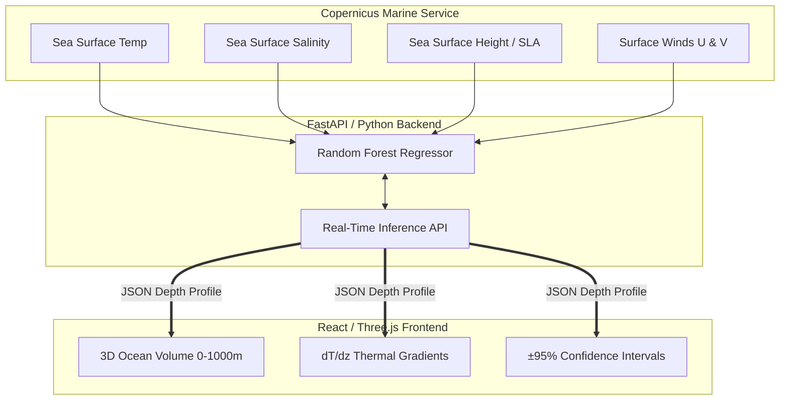

<div align="center">
  
  
  # OceanEmbed
  **AI-Driven 3D Ocean Thermodynamic Reconstruction**
  
  *Presented by Team CodeStormers for Smart India Hackathon (SIH26066)*

  <p align="center">
    
    
    
    
    
    
    
  </p>
</div>

---

## 🏗️ Core Architecture

OceanEmbed operates on a highly optimized, decoupled architecture separating the heavy machine-learning inference from the high-performance WebGL frontend.



---

## 🚨 The Problem: The Hidden Ocean

Satellites provide massive amounts of real-time data about the ocean's surface, but they cannot penetrate the water. The deep ocean—which drives global climate, creates cyclones, and hides submarines—remains entirely hidden from space. 

While physical sensors (like Argo floats) provide incredibly accurate deep-water readings, they are sparse and drift passively, leaving massive geographical blind spots. To fully understand ocean thermodynamics, we need a way to look *beneath* the surface without relying solely on expensive, localized physical probes.

---

## 💡 The Solution: AI Subsurface Reconstruction

**OceanEmbed** bridges the gap between surface telemetry and deep-ocean reality. 

By utilizing advanced Machine Learning (a highly tuned Random Forest Regressor), our model has learned the complex, non-linear thermodynamic relationships between surface signatures and deep-water stratifications in the North Indian Ocean. 

Instead of deploying physical sensors, OceanEmbed allows researchers to click any coordinate in the ocean and instantly generate a 3D thermodynamic volume down to **1000 meters**, using only surface satellite data.

### Key Capabilities & Impact
- **Continuous 3D Profiling:** Extrapolates temperatures across standard ocean depths (0m to 1000m) instantly.
- **Naval Stealth & Defense (dT/dz):** Calculates the precise rate of temperature change per meter (thermal gradient). This allows naval submarines to locate the *Thermocline*—critical acoustic shadow zones used to hide from enemy sonar.
- **Scientific Rigor:** Outputs are bounded by a strict **±95% Confidence Interval**, providing researchers with quantifiable margins of error.
- **Argo Float Validation:** Predictions are continuously cross-validated against real-world Argo Float ground truth data to ensure absolute accuracy.

---

## 🚀 Local Development Setup

To run this project locally, you will need Node.js and Python installed.

### 1. Start the Machine Learning Backend
```bash
cd backend
python -m venv venv
source venv/bin/activate
pip install -r requirements.txt
uvicorn app.main:app --reload
```

### 2. Start the 3D Frontend
```bash
cd frontend
npm install
npm run dev
```

*OceanEmbed is proudly open-source and built for the Smart India Hackathon.*
