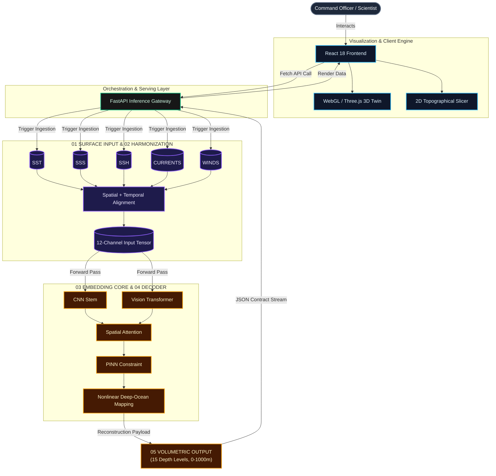

<div align="center">
  <h1 align="center">
    
  </h1>
  <strong>Satellite-Based 3D Ocean Subsurface Temperature Reconstruction</strong>
  <br/>
  <em>Presented by Team CodeStormers 20 for Smart India Hackathon (SIH26066)</em>
  <br/><br/>
  <p align="center">
    
    
    
    
    
    
  </p>
</div>

---

## 01 / The Problem

The subsurface ocean is completely opaque to electromagnetic satellite sensors. Traditionally, mapping deep-ocean temperature requires deploying physical **Argo Floats** or autonomous underwater vehicles (AUVs)—a process that is extraordinarily expensive, geographically sparse, and completely unscalable for real-time, high-resolution global monitoring. Without this data, naval submarines operate blind to acoustic shadow zones, and climatologists cannot accurately predict the explosive intensification of tropical cyclones driven by deep ocean heat.

---

## 02 / The Solution

**OceanEmbed** completely bypasses the need for physical subsurface sensors. By mathematically proving that deep-water thermal stratifications leave complex, non-linear signatures on the ocean surface, we built a proprietary **V6 Hybrid Deep Learning Engine** that looks purely at surface telemetry (SST, SSH, winds, currents) and instantly infers a continuous, high-resolution 3D temperature profile from **0 to 1000m deep**.

---

## 03 / Core Architecture



---

## 04 / Tech Stack

| Domain | Stack | Purpose in OceanEmbed |
| :--- | :--- | :--- |
| **Frontend UI** | React 18 · TypeScript · Vite · Tailwind CSS · Zustand | Lightning-fast component UI, strict type safety, and highly resilient global state management. |
| **3D & Spatial** | React Three Fiber · THREE.js · Leaflet | Hardware-accelerated WebGL ocean rendering, Earth mapping, and immersive digital twin environments. |
| **Data Visualization**| Recharts · HTML5 Canvas | Rigorous scientific charting, statistical bounds visualization, and dynamic 2D topography mapping. |
| **Deep Learning & AI** | PyTorch · TorchVision | Deep learning architecture utilizing V6 Hybrid CNN+ViT+PINN, spatial attention masks, and massive neural tensor processing. |
| **API & Serving** | FastAPI · Uvicorn · Python 3.10 | High-concurrency REST API layer delivering sub-100ms real-time 3D volume reconstruction. |
| **DevOps** | Git · Docker · Render · Vercel | Source-code management, containerized microservices, and continuous edge deployment. |

---

## 05 / Data Sources

OceanEmbed integrates high-fidelity oceanographic and atmospheric observations used for model training, inference, and validation:

- **CMEMS / Copernicus Marine Data:** Satellite surface telemetry for SST, SSS, SSH, and wind/current vectors.
- **INCOIS Argo In-Situ Observations:** Deep-water ground-truth validation profiles deployed across the Indian Ocean.
- **ARMOR3D L4 Analysis:** Global 3D temperature and salinity multi-observation fields.

--- 

## 06 / Key Features

- **Physics-Informed Neural Networks (PINNs):** The deep learning architecture is mathematically constrained by thermodynamic governing equations, ensuring that predicted deep-water profiles strictly obey real-world fluid dynamics and ocean conservation laws.
- **Real-Time 3D Volumetric Digital Twin:** A production-ready WebGL interface acting as a live command center. Click anywhere on the Interactive Earth to instantly resolve and navigate a 1000-meter deep thermodynamic volume.
- **Acoustic Shadow Zone (SLD) Detection:** Automatically calculates the thermal gradient per meter (`dT/dz`) to precisely locate the *Thermocline*—providing naval tacticians with critical stealth parameters for submarine operations.
- **Interactive 2D Topographical Slicing:** Transition seamlessly into a hardware-accelerated 2D depth slice, allowing users to scrub horizontally through a physical ocean transect and observe thermal layers in high-fidelity cross-sections.
- **Marine Heatwave & Anomaly Tracking:** Integrates live predicted profiles against massive 20-year historical climatology baselines to instantly generate dynamic anomaly heatmaps, detecting deeply trapped oceanic heat before it breaks the surface.
- **Zero-Latency Cinematic Auto-Pilot:** Jumpstart operations with a highly engineered, cinematic presentation sequence that scripts the user interface through global coordinates, 3D explorations, and 2D slicing, powered by an unbreakable background execution loop.

---

## 07 / Deep Learning Pipeline

1. **Dual-Resolution Training:** Trained on a massive cached dataset of the North Indian Ocean using 30 Years of Monthly Climatology (for long-term baseline stability) and 5 Years of Daily High-Res Data (for mesoscale turbulence and eddy detection).
2. **12-Channel Input Tensor:** Feeds 12 rigorously engineered surface layers into the network: SST, SSS, SSH, U-Current, V-Current, U-Wind, V-Wind, Normalized Lat/Lon, Bathymetry, and Sin/Cos of the Day-of-Year.
3. **CNN + ViT + Self Attention + PINN:** CNNs are exceptional at extracting localized physical anomalies (like upwelling fronts), Vision Transformers and self-attention mechanisms capture global basin teleconnections (e.g., how Arabian Sea winds affect the Bay of Bengal's stratification), and Physics-Informed Neural Networks (PINN) enforce strict thermodynamic conservation laws.
4. **Hold-Out Validation & Evaluation:** OceanEmbed uses a strict temporal hold-out strategy. The model is trained using historical data from 1996–2024 and is evaluated exclusively against unseen Jan 2025–May 2026 INCOIS Argo observations. The 2025–2026 evaluation period is completely sequestered from training. We rigorously benchmark the model using standard scientific metrics, including **RMSE**, **MAE**, **R²**, and Pearson **correlation**, consistently achieving a low **reconstruction error** and a high overall **evaluation score**.

---

## 08 / Local Development Setup

OceanEmbed is structurally isolated into a React UI tier and a FastAPI PyTorch serving tier.

### 1. Start the Machine Learning Backend
```bash
cd backend
python -m venv venv
source venv/bin/activate
pip install -r requirements.txt --extra-index-url https://download.pytorch.org/whl/cpu
uvicorn app.main:app --reload
```
*The backend mounts to `http://localhost:8000` and serves the V6 Hybrid `.pth` weights.*

### 2. Start the 3D Frontend
```bash
cd frontend
npm install
npm run dev
```
*The frontend mounts to `http://localhost:5173`. Ensure you have Node.js v18+ installed.*

---

## 09 / Future Roadmap

- [ ] **Coupled Ocean-Atmosphere Thermodynamic Engine:** Expand the V6 Architecture beyond the ocean to simulate bidirectional heat-flux across the air-sea boundary, allowing for true 4D tracking of how trapped subsurface heat directly fuels extreme atmospheric weather systems.
- [ ] **Acoustic Ray-Tracing Engine:** Build a WebGL-based sonar wave propagation simulator directly into the 3D browser, using our predicted sound velocity profiles to visualize exact submarine detection blind-spots.
- [ ] **Global Fleet Orchestration API:** Expose the 3D thermal array via a high-speed gRPC API to serve as the primary pathfinding intelligence for swarms of Autonomous Underwater Vehicles (AUVs) navigating extreme ocean pressures.
- [ ] **Low-Orbit Edge Quantization:** Compress the PyTorch inference weights using INT8 quantization to deploy the model directly onto satellite edge-nodes, broadcasting processed 3D thermal data directly from space.

---

## 10 / Problem Statement

| Field | Details |
| :--- | :--- |
| **Problem Title** | OceanEmbed - Satellite Embedding-Based Deep Learning Framework for Reconstruction of Subsurface Ocean Temperature from Surface Satellite Observations |
| **Problem ID** | SIH26066 |
| **Theme** | Disaster Management |
| **Organization** | Ministry of Earth Sciences (MoES) |
| **Department** | Indian National Centre for Ocean Information Services (INCOIS) Ocean Valley |

---

<div align="center">
  <i>Scientifically rigorous. Architecturally bulletproof.<br>Built with ❤️ by Team CodeStormers 20 for Smart India Hackathon.</i>
</div>
